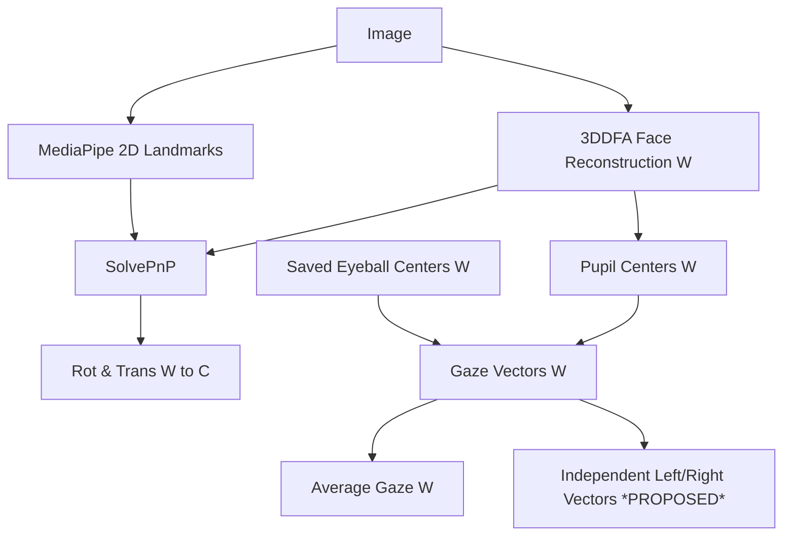

# Visual Diagrams

```mermaid
graph TD
    A[Image] --> B[MediaPipe 2D Landmarks]
    A --> C[3DDFA Face Reconstruction W]
    B --> D[SolvePnP]
    C --> D
    D --> E[Rot & Trans W to C]
    C --> F[Pupil Centers W]
    G[Saved Eyeball Centers W] --> H[Gaze Vectors W]
    F --> H
    H --> I[Average Gaze W]
    H --> J[Independent Left/Right Vectors *PROPOSED*]
```
